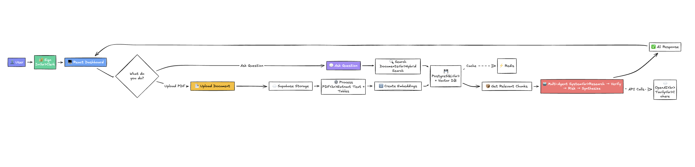
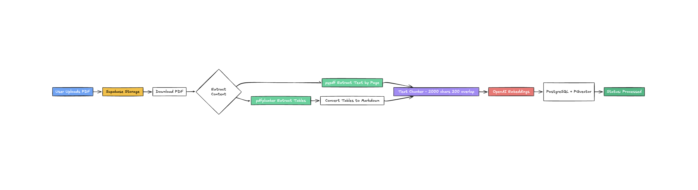
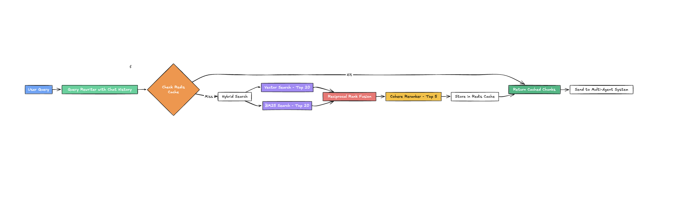
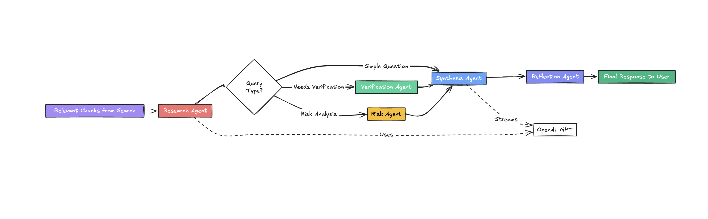

# FinSight

AI-powered financial document analyzer with multi-agent RAG system. Upload financial PDFs (10-K, 10-Q, earnings reports) and get instant, verified insights through natural language queries.

---

## System Overview

FinSight enables users to upload financial documents and query them using natural language. The system processes PDFs, extracts text and tables, creates embeddings, and uses a multi-agent RAG pipeline to generate accurate, sourced responses.



**How it works:**
1. User signs in via Clerk authentication
2. Two main flows: Upload documents or Ask questions
3. Uploaded PDFs are processed and stored in vector database
4. Queries trigger hybrid search + multi-agent analysis
5. AI generates responses with source citations

---

## Document Ingestion

When you upload a PDF, FinSight extracts both text and financial tables, chunks the content, and creates vector embeddings for semantic search.



**Pipeline:**
1. **Upload**: PDF stored in Supabase Storage
2. **Text Extraction**: pypdf extracts text page-by-page
3. **Table Extraction**: pdfplumber extracts tables, converts to markdown
4. **Chunking**: RecursiveCharacterTextSplitter (2000 chars, 200 overlap)
5. **Embeddings**: OpenAI text-embedding-3-small creates vectors
6. **Storage**: Chunks stored in PostgreSQL with pgvector extension

---

## Document Retrieval

Query processing uses hybrid search combining vector similarity and keyword matching, then reranks results for optimal relevance.



**Hybrid Search System:**
1. **Query Rewriting**: Incorporates chat history for context
2. **Cache Check**: Redis cache lookup (1-hour TTL)
3. **Vector Search**: pgvector cosine similarity (Top 20)
4. **BM25 Search**: rank-bm25 keyword matching (Top 20)
5. **Reciprocal Rank Fusion**: Combines both result sets
6. **Reranking**: Cohere rerank-english-v3 selects Top 5 chunks
7. **Cache Storage**: Results cached for future queries

---

## Multi-Agent System

FinSight uses 5 specialized agents orchestrated by LangGraph. Based on query complexity, different agents are activated to ensure accuracy and completeness.



**Agent Pipeline:**

**1. Research Agent** (always runs)
- Extracts financial data from retrieved chunks
- Processes web search results (Pro/Admin only)
- Routes to next agent based on query type

**2. Verification Agent** (conditional)
- Cross-checks research claims against source documents
- Validates numbers, dates, and page references
- Flags unverified statements

**3. Risk Agent** (conditional)
- Identifies financial risks from documents
- Categorizes by severity: High, Medium, Low
- Extracts risk factors and litigation details

**4. Synthesis Agent** (always runs)
- Combines outputs from all previous agents
- Formats response with markdown tables
- Streams tokens in real-time via Server-Sent Events
- Adds source citations (page numbers, URLs)

**5. Reflection Agent** (always runs)
- Final quality check on generated response
- Adds disclaimers if needed
- Ensures accuracy and completeness

**Routing Logic:**
- Simple queries: Research → Synthesis → Reflection
- Complex queries: Research → Verification → Synthesis → Reflection
- Risk queries: Research → Verification → Risk → Synthesis → Reflection

---

## Tech Stack

**Frontend:** React, Vite, Clerk (auth), Tailwind CSS

**Backend:** FastAPI, LangGraph (multi-agent orchestration), Celery

**AI Models:** OpenAI GPT-4o/GPT-4o-mini, text-embedding-3-small

**Database:** Supabase (PostgreSQL + pgvector)

**Cache:** Upstash Redis

**External APIs:** Cohere (reranking), Tavily (web search)

**Document Processing:** pypdf (text), pdfplumber (tables), LangChain (chunking)

---

## Key Features

- Upload financial PDFs (10-K, 10-Q, earnings reports)
- Ask natural language questions about your documents
- Hybrid search combining vector similarity and keyword matching
- Multi-agent verification for accuracy
- Real-time token streaming responses
- Source citations with page numbers
- Redis caching for fast repeated queries
- Web search integration for latest financial data (Pro/Admin)
- Table extraction and markdown conversion
- Chat sessions with conversation history

---

## Quick Start

### Prerequisites
- Python 3.11+
- Node.js 18+
- Supabase account (PostgreSQL + Storage)
- Upstash Redis account
- OpenAI API key
- Clerk account

### Backend
```bash
cd server
poetry install
poetry run uvicorn app.main:app --reload
```

### Frontend
```bash
cd client
npm install
npm run dev
```

---

## Contact

**Email:** smd.20sa@gmail.com

---

## License

MIT License
